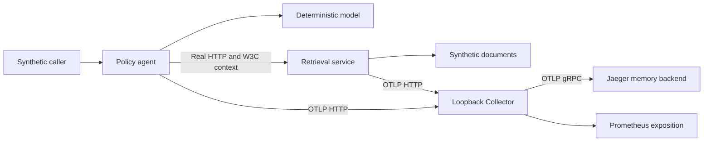
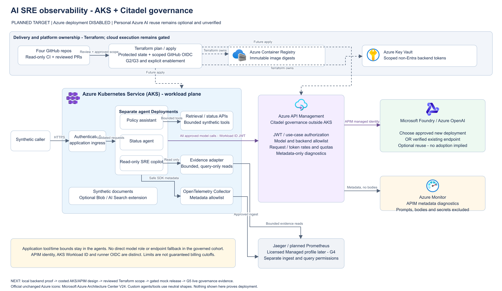
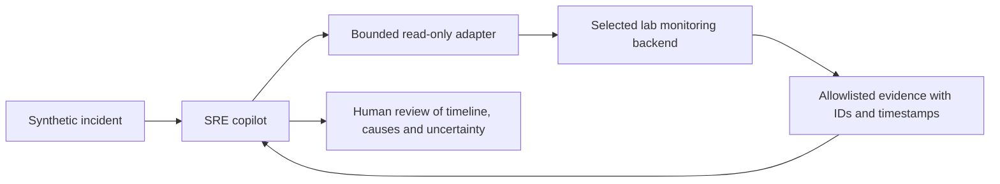

# High-level design — current, target and remaining work

Version: 0.14 local backend proof. Updated: 1 November 2026, Asia/Dubai. Execution: **local deterministic backend proof verified; AKS/APIM remains a target; Azure execution remains disabled**.

## Purpose

Provide three synthetic use cases: a policy assistant, a service-status agent and a read-only SRE copilot. Observe AI workload behavior separately from using AI to investigate monitoring evidence. Use personal Azure/GitHub targets; preserve Dynatrace Managed as the preferred later compatibility profile.

Confirmed implementation choices: **Terraform owns Azure infrastructure**, Helm/Kubernetes manifests own workload/observability deployments, and four repositories under `AI-SRE-Oberveability` separate resource ownership. The organization is owned by the personal account `javedkumail`. All four transferred repositories retain their IDs, published commits and public visibility. The infrastructure destination is `AI-Observability-Infra`; other names match the source folders. Reviewed source is published to all four repositories; initial commit receipts are recorded below. GitLab credentials remain intact. Engineering standards are defined in `docs/engineering-standards.md`.

## Verified local deterministic slice

```mermaid
flowchart LR
  T[Synthetic caller] --> A[Policy agent]
  A --> M[Deterministic model]
  A -->|Real HTTP and W3C context| R[Retrieval service]
  R --> D[Synthetic documents]
  A -->|OTLP HTTP| C[Loopback Collector]
  R -->|OTLP HTTP| C
  C -->|OTLP gRPC| J[Jaeger memory backend]
  C --> P[Prometheus exposition]
```

The Windows loopback profile now has actual backend evidence: the healthy request produced exactly seven spans across two services with expected parents; a synthetic dependency 503 returned tool_error after two attempts. Collector file exports, queried Jaeger data, metric surfaces and controlled operation logs passed canary checks. Resource service/version/environment identity was checked. All owned listeners stopped; Jaeger restart returned 404 for the prior trace. See evidence/local-backend-proof.json and docs/local-backend-runbook.md.

All 18 workload tests pass without the previous TestClient warning. This is one deterministic healthy/fault cohort, not live model, P6 coverage/overhead, durable delivery, Compose, Azure or Managed proof. The native runner uses a pinned internal Jaeger read API for this bounded proof; production read adapters remain separate.

## Proposed AKS and Azure AI target

[Editable architecture board](https://www.figma.com/board/JxOlJjtrEmIFrhRU8ltID0) and [implementation plan with all three views](docs/architecture/README.md).

[Editable draw.io](docs/architecture/azure-governance.drawio) | [SVG preview](docs/architecture/azure-governance.svg) | [Governance plan](docs/architecture/governance-plan.md). Six unchanged official Microsoft Azure icons are embedded; custom agents/tools use neutral shapes.

AKS hosts separate policy/status/SRE Deployments, bounded tool APIs and the Collector. Approved live model calls pass through a separate Azure APIM service implementing the selected Citadel-inspired governance boundary. Per-service AKS Workload ID supplies gateway-scoped pod identity; APIM managed identity supplies scoped model access. GitHub OIDC remains a separate deployment identity boundary. Governed agent identities receive no direct model-inference role. Proposed namespaces are ai-lab, observability and experiments. Helm/manifests remain with their owning workload/monitoring repositories; Terraform owns new Azure infrastructure and scoped identity/state.

The user selected an **optional existing Azure AI project reuse path**. Candidate Foundry/OpenAI endpoints, project resources, Search/Blob, ACR/Key Vault or AKS are referenced only after personal ownership, compatibility, quota, networking and cost are verified. No resource inventory, migration, import or adoption has occurred. Custom agent runtimes stay on AKS; a Foundry-hosted agent would be a separate comparison profile.

The first cluster cohort retains the deterministic model and bundled synthetic documents. Approved live-model and optional RAG cohorts follow later. Blob/Search, Prometheus storage and the expanded platform modules are proposed additions. The current Terraform code still covers one resource group; full AKS/ACR/Key Vault/networking and release deployment remain to implement.

Native OneAgent telemetry follows its supported route independently of the arbitrary Collector. Managed remains a licensed, version/sizing-gated backend on supported hosts. Read-only SRE adapters use only bounded, verified backend reads. No SaaS-specific feature is assumed on Managed.

Personal targets/region/budget, node/storage/network/runner sizing, retention, model quota and active/idle costs remain open. This diagram records the intended design, not deployed resources or cloud authorization.

## Read-only SRE path — planned

```mermaid
flowchart LR
  I[Synthetic incident] --> S[SRE copilot]
  S --> A[Bounded read-only adapter]
  A --> B[Selected lab monitoring backend]
  B --> E[Allowlisted evidence with IDs and timestamps]
  E --> S
  S --> H[Human review of timeline, causes and uncertainty]
```

The adapter cannot execute arbitrary queries, shell commands or Azure/Kubernetes writes. Managed uses verified supported APIs; SaaS-only DQL/Grail, if selected, has separate configuration. Monitoring text is untrusted data. Every substantive claim references evidence or declares uncertainty.

## Nonfunctional design

- Operational metadata is the default capture policy; prompts, completions, documents, arguments and secrets stay out of telemetry.
- Fixed service/environment/version identity and W3C context enable cross-service trace validation. Metrics avoid user/conversation/trace labels.
- Execution and telemetry queues/retries are bounded. Mock token usage stays null; actual token budgets and dated cost estimates require a live provider.
- Synthetic load, short retention, explicit lifecycle commands and scoped IaC contain lab consumption. Budget notifications are not a guaranteed spending cutoff.
- Local, cloud, live-provider, Managed and optional SaaS evidence is labelled independently.

## HLD change log and next boundary

| Version | Change | Validation state |
| --- | --- | --- |
| 0.1 | Documented existing drafts, proposed Azure/Managed target and separate SRE evidence path | Plan awaiting user review |
| 0.2 | Confirmed Terraform, four private repositories under javedkumail, GitLab coexistence, event-driven tracker and engineering standards | User choices recorded; implementation still paused |
| 0.3 | Verified four public, empty GitHub destinations created by the user; recorded exact infrastructure name | Read-only API evidence saved; no push or architecture boundary change |
| 0.4 | User approved the plan and public pushes; review sanitizes reference-environment names and fixes repository-local evidence links | Review passed: 18 workload tests, 11 tracker tests, zero staged secret findings; GitLab credentials preserved |
| 0.5 | Organization created; all four public repositories transferred and local remotes updated | IDs/history/ownership verified; organization documentation pushed to all four repositories |
| 0.6 | Shared Project #1 links all four repositories and mirrors 36 task issues through event-driven synchronization | Live task/link/view checks and 20 tracker/sync tests passed; source/cloud validation boundaries unchanged |

**What we are going to do next:** resume P1.1 local review and backend proof. Before enabling Azure execution, confirm personal targets/region/budget, review the concrete scope/cost, and establish protected state and scoped OIDC identities. Organization, shared tracking and four main-branch CI pipelines are verified.

**What remains:** backend ingestion/lifecycle evidence; repository/CI completion; personal targets and budget; costed Azure IaC/deployment; Managed entitlement and compatibility; status agent; SRE adapter/copilot; live-provider and comparison experiments; demo, rebuild and teardown.

After every work step the tracker supplies current status, next executable work and remaining decisions. Update this HLD whenever a component, boundary, ownership rule or telemetry path changes.

<!-- publication-progress -->

## Verified source publication

| Repository | Initial reviewed commit | Status |
| --- | --- | --- |
| ai-observability-infra | `b21c746acac6` | Pushed and verified |
| ai-agent-workloads | `6fc332a2cddf` | Pushed and verified |
| ai-observability-config | `9d81a64e0fea` | Pushed and verified |
| ai-observability-lab | `0d5cf9f01db8` | Pushed and verified |

The lab receipt pins the initial reviewed source commit; later coordination updates are descendants. Initial source publication alone did not establish backend delivery, CI execution or cloud/Managed deployment; later CI evidence is recorded separately. Component ownership is unchanged.

## Organization migration status

`AI-SRE-Oberveability` is created on GitHub Free, and authenticated membership verifies javedkumail as active owner. 4/4 repositories have transferred with IDs, commits and public visibility preserved. [Shared Project #1](https://github.com/orgs/AI-SRE-Oberveability/projects/1) is verified with 41 unique task issues, all four repository links, Delivery board and All tasks views. GitLab credentials and global Git helpers remain unchanged.

| Repository | Actual owner | Transfer verification |
| --- | --- | --- |
| AI-Observability-Infra | AI-SRE-Oberveability | transferred_and_verified |
| ai-agent-workloads | AI-SRE-Oberveability | transferred_and_verified |
| ai-observability-config | AI-SRE-Oberveability | transferred_and_verified |
| ai-observability-lab | AI-SRE-Oberveability | transferred_and_verified |

Organization grouping changes repository ownership and future OIDC inputs, not component responsibilities. Verify the actual new owner/repository OIDC subject before configuring Azure federation. No Azure federation was deployed before this move.

## Project setup continuation — 29 October 2026

The existing organization Project #1 was completed after browser reconnection and verified as AI SRE Observability POC. Project-capable authentication is verified as javedkumail with the user-approved project scope; no duplicate Project was created. The CLI uses isolated local configuration, and Git authentication setup was declined. Existing GitHub repository authentication remains available; no GitLab credential/global helper changes were made.

## Shared Project tracking design

Project #1 is shared across the four repositories. Managed issues mirror task acceptance, dependencies, gates and evidence; Project fields expose task ID, phase, responsible owner and exact evidence status. The board summarizes Todo/In Progress/Done. Synchronization is event driven after local work-step recording via scripts/sync_github_project.py --apply; there is no scheduled job. New authentication is limited to the separately approved GitHub CLI scope and does not alter GitLab credentials or global Git helpers.

The Project retains private visibility for authorized organization members. Public repository source and sanitized evidence remain public. Local plan/state are authoritative; human notes outside managed issue blocks are preserved. Draft, blocked and pending decisions remain distinct in Evidence status. A task moves to Done and its issue closes only when the local tracker accepts its evidence. Live verification checks issue identity/state, all managed fields, and repository links. Interrupted synchronization resumes from saved task mappings and discovers existing managed issues to avoid duplicates. See evidence/shared-project-completion.json for the setup receipt and evidence/shared-project-verification.json for the latest synchronization result.

## Actions implementation boundary — 29 October 2026

The user authorized four independent CI workflows plus guarded Terraform delivery. Current status: planning complete; implementation and GitHub runs pending. CI stays read only. Manual Terraform plan/apply will use separate protected environments and OIDC; the initial root covers only a tagged resource group. Cloud execution stays disabled until personal targets, budget, state and scoped identities are confirmed. No AKS/Managed resource or Azure identity is created in this setup. See docs/actions-delivery-plan.md. Next: implement CI, validate Terraform/guards, publish PRs, then capture actual workflow conclusions.

### Actions step 2 — source checks and protected environment setup

Four CI definitions now exist on review branches. A fresh hash-locked workload environment passed 18 tests (one existing test-client deprecation warning); tracker tests passed 20/20; deployment guard tests passed 11/11. Five workflow definitions passed actionlint after correcting context availability. Config source checks passed; Docker build/Collector validation await hosted CI. Terraform provider initialization succeeded; cross-platform locking and final Terraform validation are still being checked.

Both infra environments, azure-lab-plan and azure-lab-apply, are verified main-only with owner review and administrator bypass disabled. The repository deployment flag is false; no Azure values, identities or roles were configured. GitHub reports an immutable OIDC subject prefix using organization/repository IDs; actual environment token/federation validation remains an Azure bootstrap prerequisite. Next: finish Terraform checks and reviewed PR publication, then capture real CI results.

### Actions step 3 — Terraform validation and review publication

Terraform foundation validation passed with AzureRM 5.11.0, and both mocked invalid-scope/expiry tests passed. Eleven Python safety tests cover disabled execution, branch/repository restrictions, target/context checks, reviewed-plan binding and destructive/scope-expanded plan rejection. Windows provider communication required a retry outside the restricted execution sandbox; no Azure login or cloud plan was run. Cross-platform package locking is still being collected; signed registry archive checksums already exist in the lock. Workload and observability PRs are open and hosted CI is running. Publication checks excluded generated Python cache files before the infra push. Next: complete all four PR checks and capture main-branch results; Azure execution stays disabled.

### Actions step 4 — all four PR pipelines validated

All four implementation PRs passed hosted CI. Workloads passed 18 tests and built its container; observability passed Compose and the real Collector validator; lab passed 20 tracker/sync tests; infra passed 11 safety tests, strict backend-disabled Linux init/validate and two mocked Terraform scope tests. The Linux lock mismatch was fixed by generating its real package hash from an official archive verified against signed registry metadata; strict readonly checks remain enabled. No cloud authentication or provisioning ran. See evidence/actions-pr-validation.json and evidence/actions-provider-lock-review.json.

The automatic approval review rejected merging workload PR 9 because explicit merge authorization was not present. At this review stage the PRs remained open. The user subsequently approved the four merges and final tracking receipt update; main CI and the live disabled-dispatch check are now verified in step 5 below. Both protected infra environments are verified main-only with owner review and no administrator bypass. AZURE_DEPLOYMENT_ENABLED remains false. No Azure target values, roles or identities were added. Source and global Git configuration checks preserve GitLab access.

```mermaid
flowchart LR
  PR[Four repository PRs] --> CI[Read-only CI: tests/build/config/Terraform]
  CI --> R[Explicit merge approval]
  R --> M[Main branch workflows]
  M --> D[Manual dispatch and deployment-enabled guard]
  D -.->|G2/G3 and bootstrap still pending| E[Protected plan/apply environments]
  E --> O[Separate OIDC identities]
  O --> S[Dedicated protected Blob state]
  S --> P[Private Terraform plan and review fingerprint]
  P --> A[Matching saved-plan apply: one resource group]
```

### Actions step 5 — verified activation after approved merges

The user explicitly approved the four named PR merges and the final HLD/tracker-only receipt update. All four PRs merged at their verified tested heads. All four resulting main-branch CI runs succeeded: workload tests/container build; observability source/Compose/Collector validation; lab tracker/sync tests; infra lint, 11 safety tests, strict locked Terraform initialization/validation and two mocked scope tests. The final documentation-only receipt PR is subject to the same CI checks.

The manually dispatched Terraform plan was intentionally tested with AZURE_DEPLOYMENT_ENABLED=false. It failed at the named preflight guard with the expected disabled-execution message; the entire Terraform job was skipped and Azure login did not run. This expected rejection is safety verification, not a failed Azure deployment. No target IDs, credentials, Entra identities, role assignments or Azure resources were created. GitLab credentials and global Git configuration remain unchanged. Exact source/run/merge evidence is in evidence/actions-main-activation.json and evidence/actions-disabled-deployment-verification.json.

**Current delivery boundary:** CI is active in all four repositories; manual Terraform plan/apply code and protected environments are configured. Actual Azure execution remains disabled pending G2/G3, state bootstrap, separate scoped plan/apply identities and verification of environment-specific immutable OIDC claims. The concrete Terraform root currently owns one tagged resource group. AKS/platform resources, registry publication, workload rollout, local backend proof, Managed and live models remain later work.

## Architecture step — 29 October 2026

Three editable diagrams now cover the AKS application target, telemetry/read-only SRE profiles and the CI-to-Terraform-to-AKS implementation sequence. The implementation guide defines namespace/resource ownership, separate runner/pod identities, optional existing-resource checks, cost/access gates and stage exits. The user chose an optional Azure AI reuse path; no existing cloud project is assumed available. The current accepted count remains 11/38: diagram completion does not close P1 backend, P3 cost/deployment, Managed or live-model tasks.

**Next implementation:** prove the local policy/telemetry slice, then confirm personal Azure targets and costs; build bootstrap/platform Terraform and image/release/Helm delivery before any approved AKS deployment. See docs/architecture/README.md for the full sequence and public design references. GitLab credentials and global Git configuration remain unchanged.

## Historical Citadel reference review — 1 November 2026

The later selection below supersedes the optional-only recommendation in this review; the review remains historical evidence.

Reviewed the user-provided [Citadel lab](https://microsoftlearning.github.io/mslearn-ai-governance/lab/) and its workshop/upstream documentation. The [fit review and proposed adoption sequence](docs/architecture/citadel-governance-review.md) records APIM as an optional governance experiment around approved live model calls. AKS remains the proposed custom-agent runtime, with separate OTel/backend and bounded read-only SRE paths. Terraform remains the sole Azure resource owner.

No gateway component, SKU, cloud scope or upstream code was adopted. Existing resource reuse stays optional and unverified. Privacy, source-version, networking, identity, cost and teardown differences must be resolved before implementation. Current diagrams retain the agreed baseline; a gateway view follows only if that experiment is selected.

**Next:** P1.1 local draft review, then real backend proof. **Remaining:** G2 personal targets/region/budget, G3 costed scope authorization, G4 Managed entitlement/compatibility, G5 live model/quota approval; platform Terraform, AKS delivery and experiments. The architecture proposal remains in PR #21; Azure execution remains disabled.

## Citadel/APIM selected in the target — 1 November 2026

The user requested inclusion of governance in the architecture and execution plan. [Three current views and retained baseline](docs/architecture/README.md) and the [governance work plan](docs/architecture/governance-plan.md) now cover AKS agents -> APIM outside AKS -> an approved new or verified existing Foundry/OpenAI model endpoint. This is design selection; resource sizing, costs and cloud execution remain unapproved.

Terraform owns APIM, backend/access inventory, identities, network/DNS, diagnostics and versioned XML policy fragments. Workloads own the governed adapter and bounded error/retry behavior; observability-config owns capture/correlation requirements; lab owns experiments and evidence. The application keeps tool/time bounds and read-only SRE controls. Gateway diagnostics follow an Azure Monitor route independently of the Collector; no trace continuity or supported Managed result is inferred from this drawing.

P3.7 tracks governance IaC before the concrete combined plan review; P5.5 tracks the gateway adapter; P6.6 tracks gateway/privacy/lifecycle evidence without making Managed a prerequisite. The shared plan now has 41 tasks, with 11 accepted deliverables. The earlier baseline remains labelled on the board and under docs/architecture/baseline-2026-10-29.

**Next:** finish P1.1 and local backend proof. **Remaining:** G2 targets/region/budget, costed AKS/APIM design and protected state/OIDC; G3 scope authorization; Terraform platform/gateway and AKS release; G5 live usage and governed validation; G4 Managed compatibility and later SRE/experiments. Azure deployment remains disabled and GitLab credentials/global configuration remain intact.

The user also selected a draw.io companion using official Azure icons. Its editable source, standalone SVG/PNG and icon provenance/rights notice are published with this design. The original FigJam views remain labelled baselines, and the three current views are added. Figma Starter quota prevented the final telemetry caption re-export; the documented flow, source and independent draw.io companion remain available. No Azure enablement or GitLab credential change occurred.

## PR #21 merged; local proof started - 1 November 2026

The user explicitly authorized merging PR #21. The verified head f59c9a48a73191c2efaec6f4976b6382b2e8407d passed CI and merged as dec89a84160bea68cd1f5d0a37aa54f4aaad95b3. The AKS/APIM design and official-icon diagram are now on main. See evidence/pr21-merge.json and [the local proof plan](docs/local-backend-proof-plan.md).

Current runtime evidence still covers the prototype and in-memory tests, not completed backend ingestion. Next: P1.1 application/contract/dependency review, then a bounded real Collector/Jaeger run. Cloud sizing, Terraform platform, Managed and live-model gates remain pending. Azure deployment stays disabled; GitLab/global Git credentials remain intact.

## Local review completed - 1 November 2026

P1.1 reviewed the policy/retrieval contracts, deterministic adapter, bounds, capture policy and locked versions. The current baseline passed 18 tests with one known TestClient deprecation; the CI input gap is already resolved. See evidence/local-workload-review.md and evidence/local-review-baseline.json. This proves local HTTP/in-memory assertions only.

Next: replace the deprecated test transport with the existing loopback fixture and validate a separate native Windows Collector/Jaeger profile. Real backend retrieval, exported-data canaries and owned-process lifecycle remain to prove. AKS/APIM, Azure spending, Managed and live models remain pending; Azure deployment stays disabled.

## Contracts and native preparation - 1 November 2026

The deprecated TestClient test now uses the existing real Uvicorn/HTTPX fixture. All 18 workload tests pass without warnings, including both OpenAPI schemas, real tool HTTP, typed outcomes, exact in-memory span edges and metadata checks. Native loopback-only Collector/Jaeger configurations pass their actual pinned validators. See evidence/local-workload-correction.json and docs/local-backend-runbook.md.

The first real backend attempt retrieved healthy/fault traces and passed canary checks, then failed a restart assertion because an expected 404 was not classified as absence. That failed attempt is retained in evidence/local-proof-attempt-1.json; a corrected rerun is pending before full acceptance. The runner owns its processes, captures and cleanup. Cloud, Managed and live models remain unproved and Azure disabled.

## Local backend boundary accepted - 1 November 2026

The corrected one-shot proof passed after the first restart-404 assertion failure; both attempts are retained. P1.4/P1.5/P1.6 can be assessed from exported/backend data and owned-process lifecycle, independently of cloud scope. Next: publish the workload/config/runner review PRs and verify hosted CI. The new configuration-checker source invalidates its earlier main-CI receipt until review/merge/revalidation; the tracker exposes that dependency rather than assuming new code ran on main. Azure deployment remains false, GitLab/global settings unchanged, and all local services are stopped.

## Local proof published for review - 1 November 2026

Workloads PR #11, observability-config PR #5 and lab PR #23 contain the test correction, native profiles and reproducible runner/evidence respectively. See evidence/local-proof-publication.json. Source review found no confirmed secrets; reviewed matches are source-file SHA256 receipts. PR #21 is merged; these new PRs remain open.

All six P1 steps have local acceptance evidence. The tracker is 15/41 because P2.8 needs revalidation of the changed configuration checker on main, and P2.9 depends on that receipt. Hosted branch checks are tracked on the PRs separately. Next: review/merge follow-up changes, verify main CI, then complete multi-repository release pinning. No cloud gate is accepted. Azure deployment remains false; global Git settings match the preservation baseline and GitLab credentials were not changed. All owned local listeners are stopped.
